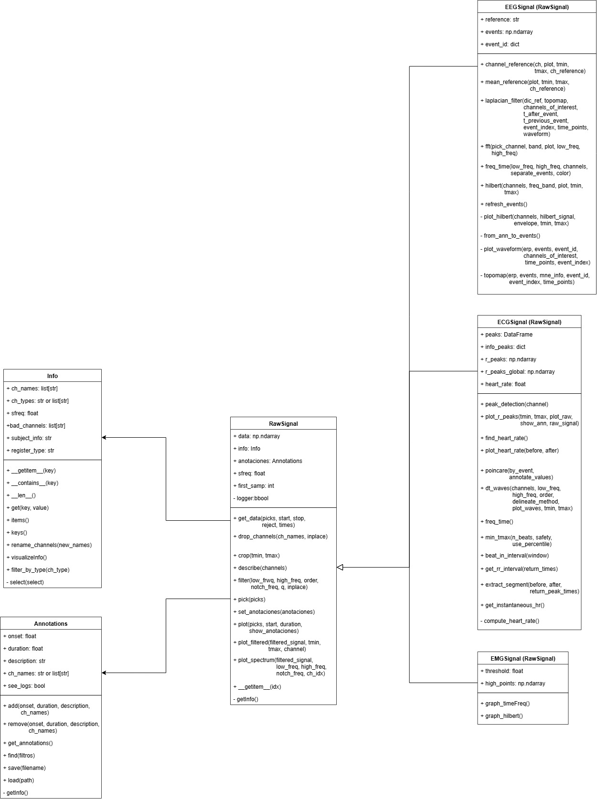

# Physiosignal

Una librería desarrollada en Python para el procesamiento, análisis y visualización de señales fisiológicas de EEG, ECG y EMG utilizando Programación Orientada a Objetos (POO).

---

## 📌 Objetivos

### Objetivo General
Diseñar e implementar una librería modular y escalable para el procesamiento de señales fisiológicas, aplicando técnicas de filtrado, detección de eventos y análisis espectral.

### Objetivos Específicos
- Implementar clases para manejo de señales (`RawSignal`, `EEGSignal`, `ECGSignal`, `EMGSignal`).
- Integrar herramientas como NumPy, Pandas y Matplotlib para procesamiento y visualización.
- Aplicar técnicas de filtrado (pasabanda, notch) y detección de eventos (picos R en ECG, activaciones en EMG).
- Garantizar calidad mediante pruebas sistemáticas y gestión de versiones con Git/GitHub.

---

## 🗂 Estructura del Repositorio
```plaintext
tif_2025/                  # Directorio raíz
├── physiosignal/          # Código fuente del sistema
│   ├──info/
│   │   ├── __init__.py
│   │   ├── annotations.py
│   │   ├── info.py
│   ├── logger/
│   │   ├── __init__.py
│   │   ├── logger_config.py
│   ├── signals/
│   │   ├── __init__.py
│   │   ├── ecg.py         
│   │   ├── eeg.py
│   │   ├── emg.py         
│   │   ├── raw.py
│   ├── utils/
│   │   ├── __init__.py
│   │   ├── a_checkers.py
├── testings/
│   ├── test_sys.ipynb 
├── __init__.py
├── .gitignore
├── README.md
├── requirements.txt
└── setup.py
```
---

## 📐 Diagrama de Clases UML



---

## ⚙️ Requisitos

- **Python 3.10 o superior**.
- Entorno de desarrollo recomendado: **Visual Studio Code**.
- Dependencias principales:
  - NumPy
  - Pandas
  - Matplotlib
  - SciPy
  - PyQtGraph
  - PyQt5
  - MNE
  - NeuroKit2
